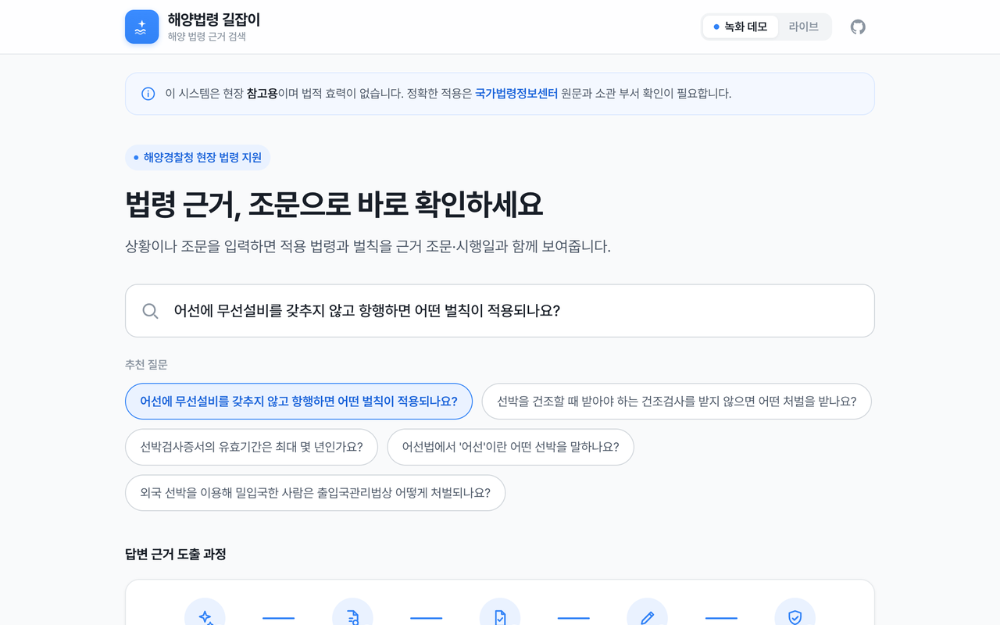
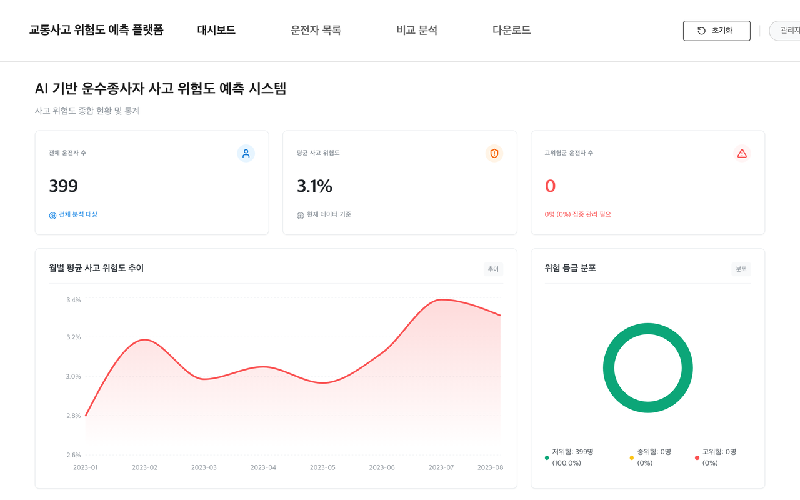
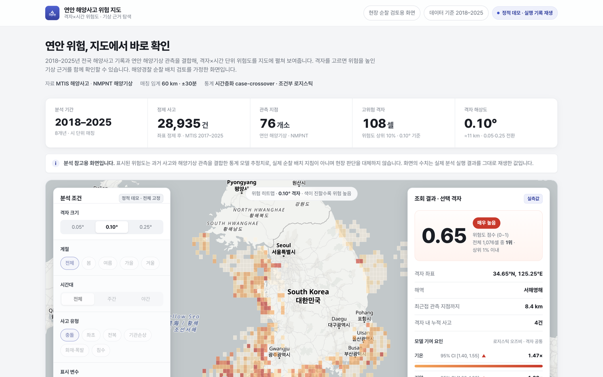

### LLM 에이전트와 ML 시스템을 만들고, 실제로 돌아가는 서비스로 배포하는 AI 엔지니어입니다.

> [!NOTE]
> 전체 프로젝트 16개의 배경·접근·결과는 [**포트폴리오 사이트**](https://minsu5452.github.io)에 정리되어 있습니다.

## 🚀 대표 프로젝트

실무에서 수행한 과제를 공개 가능한 형태로 재구성했습니다. 설계 판단과 검증 과정은 각 저장소에, 동작은 라이브 데모에서 확인할 수 있습니다.

<table>
  <tr>
    <td width="50%" valign="top">
      
      <h3><a href="https://github.com/Minsu5452/maritime-law-rag-agent">해양 법령 RAG 에이전트</a></h3>
      해양 법령 105개(7,506개 조문)를 BM25·벡터·조문 관계 그래프로 함께 검색하고, 답변마다 근거 조문을 인용합니다. LangGraph 라우팅으로 질문 유형별 검색 전략을 고르고, 골드셋 180문항으로 검색 품질을 검증했습니다.  
      <a href="https://korean-maritime-law-rag.vercel.app"><b>🔗 라이브 데모</b></a> · <a href="https://github.com/Minsu5452/maritime-law-rag-agent">저장소</a> 
      LangGraph · Qdrant · Neo4j · OpenAI API · FastAPI
    </td>
    <td width="50%" valign="top">
      
      <h3><a href="https://github.com/Minsu5452/driver-risk-prediction-platform">교통사고 위험 예측 플랫폼</a></h3>
      운수종사자의 검사 결과와 사고 이력을 학습한 앙상블 모델로 사고 위험도를 예측하고, SHAP 해석과 함께 화면에서 조회·관리합니다. 예측 모델과 FastAPI 서빙, 관리 웹, 망분리 운영 환경에 맞춘 오프라인 배포 체계까지 전 구간을 개발했습니다.  
      <a href="https://github.com/Minsu5452/driver-risk-prediction-platform"><b>저장소</b></a> 
      LightGBM · SHAP · FastAPI · React · Nginx
    </td>
  </tr>
  <tr>
    <td width="50%" valign="top">
      
      <h3><a href="https://github.com/Minsu5452/marine-accident-risk-analysis">연안 해양사고 위험 분석</a></h3>
      해양사고 28,935건과 해양기상 관측을 결합해 격자×시간 단위 위험도를 추정하고, 기상과 사고의 연관을 시간층화 case-crossover로 검증했습니다. 지도 대시보드는 실제 분석 실행 결과를 키 없이 재생합니다.  
      <a href="https://korean-marine-accident-risk.vercel.app"><b>🔗 라이브 데모</b></a> · <a href="https://github.com/Minsu5452/marine-accident-risk-analysis">저장소</a> 
      LightGBM · statsmodels · FastAPI · Next.js · MapLibre
    </td>
  </tr>
</table>

나머지 13개 프로젝트는 [포트폴리오 사이트](https://minsu5452.github.io/projects/)에서 볼 수 있습니다.

## 💼 경력

### 데이콘

**Data Science팀 매니저** · `2025.12 – 현재`

공공 데이터 분석 과제 2건의 PL과 AI 경진대회 기획·운영을 맡고 있습니다.

#### ▎개발

| 프로젝트 | 기간 | 역할 | 내용 |
| --- | --- | :---: | --- |
| **입찰 모니터링 모델 개발** | 2026.06&nbsp;–&nbsp;현재 | PL | 행안부·NIA·조달청 데이터 분석 사업 · 진행 중 |
| **운수종사자 위험 예측 모델 개발** | 2025.12&nbsp;–&nbsp;2026.04 | PL | 행안부·NIA·한국교통안전공단 데이터 분석 사업. 예측 모델과 서빙 API·관리 웹·망분리 환경 배포까지 전 구간 수행 |

#### ▎기획·운영

AI 경진대회와 해커톤의 과제 설계, 대회용 데이터 구성, 참가자·리더보드 운영을 담당합니다.

### 슈어소프트테크

**AX응용기술팀 AI 개발자 (인턴)** · `2025.06 – 2025.11`

해양수산부·해양경찰청 R&D 과제에서 AI 개발 실무를 맡고, KT와 에이전트 신뢰성 검증을 함께 수행했습니다.

#### ▎개발

| 프로젝트 | 내용 |
| --- | --- |
| **해양사고 위험 예측 시스템** | 해양수산부 AI융복합 과제. 격자×시간 단위 데이터 설계, 위험 예측 모델 학습, SHAP 해석 |
| **해양 법령 도메인 RAG** | 해양경찰청 CDX 과제. 법령 도메인 RAG DB 구축과 검색·답변 흐름 구성에 참여 |

#### ▎검증

| 프로젝트 | 내용 |
| --- | --- |
| **KT 에이전트 신뢰성 검증** | KT와 공동 수행. 에이전트 검증 데이터셋 구축, 실성능 테스트, 화이트리스트 작성 |

## 🛠 기술 스택

| 영역 | 기술 |
| --- | --- |
| LLM · Agent |       |
| ML · 데이터 |       |
| 서빙 · 인프라 |       |
| 웹 |    |

## 🏆 수상 · 대회

데이콘 플랫폼 대회에서 1위·2위를 포함해 8개 대회 상위권을 기록했습니다. 순위는 각 대회의 공개 리더보드에서 확인할 수 있습니다.

| 연도 | 대회 | 주제 | 결과 |
| :---: | --- | --- | :---: |
| 2023 | [유전체 정보 품종 분류 AI 경진대회](https://github.com/Minsu5452/genomic-breed-classification) | SNP 품종 분류 | **1위** |
| 2023 | [법원 판결 예측 AI 경진대회](https://github.com/Minsu5452/court-judgment-prediction) | 판결문 승소 당사자 분류 | **2위** |
| 2023 | [HD현대 AI Challenge](https://github.com/Minsu5452/ship-waiting-time-prediction) | 선박 대기시간 예측 | **2위** |
| 2023 | [온라인 채널 제품 판매량 예측 AI 해커톤](https://github.com/Minsu5452/online-sales-forecasting) | 판매량 시계열 예측 | 상위 1.6% |
| 2025 | [제3회 국민대학교 AI빅데이터 분석 경진대회](https://github.com/Minsu5452/industrial-lead-lag-forecasting) | 산업 지표 lead-lag 예측 | 상위 5.2% |
| 2022 | [감귤 착과량 예측 AI 경진대회](https://github.com/Minsu5452/citrus-yield-prediction) | 착과량 예측 | 상위 6.6% |
| 2025 | [운수종사자 교통사고 위험 예측 AI 경진대회](https://github.com/Minsu5452/driver-cognitive-risk-prediction) | 사고 위험 확률 예측 | 상위 7.8% |
| 2023 | [2023 전력사용량 예측 AI 경진대회](https://github.com/Minsu5452/power-consumption-forecasting) | 건물별 전력사용량 예측 | 상위 8.7% |

## 📄 논문

| 학술대회 | 논문 |
| --- | --- |
| AAiCON 2023 제2차 실용 인공지능 학술대회 | [SNP 정보를 활용한 유전체 품종 분류 모델링에 대한 연구](https://github.com/Minsu5452/snp-breed-classification-paper) |

## 📚 학부 프로젝트

| 기간 | 과목 | 프로젝트 |
| --- | :---: | --- |
| 2022.09 – 2022.12 | 딥러닝 | [이미지 컬러화 모델 비교](https://github.com/Minsu5452/dl-image-colorization) |
| 2022.09 – 2022.12 | 텍스트 마이닝 | [국민대·정릉시장 리뷰 토픽 모델링](https://github.com/Minsu5452/text-mining-review-topics) |
| 2022.03 – 2022.06 | 머신러닝 | [백화점 고객 구매 이력 분류 (수업 내 Kaggle 대회 2위)](https://github.com/Minsu5452/ml-department-store-classification) |

## 🎓 학력

| 기간 | 학교 | 전공 | 학위 |
| --- | --- | --- | :---: |
| 2018.03 – 2024.08 | 국민대학교 | AI빅데이터융합경영학과 (심화전공) | 학사 졸업 |

## 📜 자격증 · 어학

| 자격증 | 발급 기관 | 취득일 |
| --- | --- | --- |
| **제60회 SQL 개발자 (SQLD)** | 한국데이터산업진흥원 | 2026.03.27 |
| **제12회 빅데이터분석기사 (필기)** | 한국데이터산업진흥원 | 2026.04.24 |

| 시험 | 등급·점수 | 응시일 |
| --- | --- | --- |
| TOEIC Speaking Test | **Intermediate Mid 3 (Speaking 130)** | 2025.02.22 |

## 🌱 활동

| 기간 | 기관 | 프로그램 | 역할 |
| --- | --- | --- | :---: |
| 2023.10 – 2023.11 | 국민대학교 경영대학 | [연결고리 14기 (현업 동문 진로 멘토링)](https://github.com/Minsu5452/kookmin-mentoring-14th) | 멘티 |
| 2023.09 – 2024.03 | BDA (대학생 연합 빅데이터 학회) | 7기 데이터 분석 고급반 | 학회원 |
| 2023.07 – 2023.09 | LG AI Research | LG Aimers 3기 (LG 청년 AI 인재 양성) | 교육생 |
| 2023.03 – 2023.12 | D&A (국민대학교 빅데이터 분석 학회) | 딥러닝 세션 | 학회원 |
| 2022.03 – 2022.12 | D&A (국민대학교 빅데이터 분석 학회) | 머신러닝 세션 | 학회원 |
| 2021.12 – 2022.01 | D&A (국민대학교 빅데이터 분석 학회) | Python 기초 스터디 | 학회원 |
