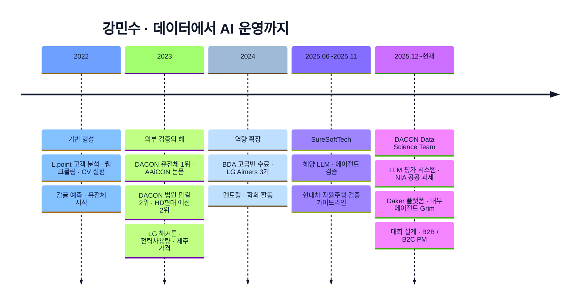

<!-- =============================================================
     HERO BANNER
============================================================= -->

 
 

 

<!-- =============================================================
     ABOUT
============================================================= -->

## 👋 About

> 한 가지 모델만 깊게 파는 사람보다,
> **문제를 정의하고 데이터를 읽고 모델을 설계한 뒤 성능을 검증하고
> 결과를 문서와 운영의 언어로 연결하는 사람**에 가깝습니다.

- 🏢 **현재** DACON Data Science Team · 대회파트 매니저
- 🤖 LLM 평가 시스템 · AI 에이전트 · 대회 설계 · B2B / B2C PM 업무를 함께 다룹니다
- 🎓 국민대학교 AI빅데이터융합경영학과 *(구. 빅데이터경영통계전공)*
- 🏅 DACON **Best 34위** · 최고 **Challenger** 티어
- 📫 `dacon@dacon.io` · `daro980722@gmail.com` · `daro98@naver.com`

<!-- =============================================================
     SNAPSHOT
============================================================= -->

## 📸 Snapshot

<table>
  <tr>
    <td valign="top" width="25%" align="center">
      <strong>🧪 실무 경험</strong>  
      DACON Data Science Team SureSoftTech AX응용기술팀
    </td>
    <td valign="top" width="25%" align="center">
      <strong>🏆 외부 검증</strong>  
      DACON 1위 · 716팀 DACON 2위 · 5인 팀장 HD현대 예선 2위 · 330팀
    </td>
    <td valign="top" width="25%" align="center">
      <strong>🛠 직접 구현</strong>  
      OCR + NER 파이프라인 LLM 평가 시스템 에이전트 검증 시나리오
    </td>
    <td valign="top" width="25%" align="center">
      <strong>📄 확장 경험</strong>  
      학술대회 논문 기재 수상 발표 · 보고서 대회 운영 · 플랫폼 운영
    </td>
  </tr>
</table>

<!-- =============================================================
     CAREER
============================================================= -->

## 💼 Career

<table>
  <tr>
    <td width="22%" valign="top">
      <strong>2025.12 ~ 현재</strong> 
      DACON 
      <em>Competition Manager · Data Science Team</em>
    </td>
    <td valign="top">
      <ul>
        <li><b>LLM 평가 시스템 설계</b> — 동일 기준 아래 다양한 LLM을 비교하는 metric · 파이프라인 구축</li>
        <li><b>외부 AI 과제</b> — NIA·한국교통안전공단 등 공공 데이터 기반 AI 과제 수행</li>
        <li><b>Daker 플랫폼 기여</b> — Vibe-coding 기반 AI 개발 경진대회 플랫폼 개선 · 버그 대응</li>
        <li><b>내부 에이전트 (Grim)</b> — 사내 업무용 에이전트 기능 개발 · 프롬프트 운영</li>
        <li><b>대회 설계 · 운영</b> — 문제 정의부터 런칭까지 기획, B2B / B2C PM 업무</li>
      </ul>
    </td>
  </tr>
  <tr>
    <td valign="top">
      <strong>2025.06 ~ 2025.11</strong> 
      SureSoftTech 
      <em>AI Developer Intern · AX응용기술팀</em>
    </td>
    <td valign="top">
      <ul>
        <li><b>해양 특화 LLM</b> — 도메인 데이터 수집 · 파인튜닝 · retrieval 기반 응답 구조 설계</li>
        <li><b>AI 에이전트 검증</b> — 시나리오 · 데이터셋 기반 품질 평가, failure case 문서화</li>
        <li><b>현대자동차 자율주행 검증 가이드라인</b> — ML 검증 관점의 레퍼런스 문서 작성</li>
        <li><b>사내 AI 적용 리서치</b> — 실무 도입 시 고려할 metric · workflow 정리</li>
      </ul>
    </td>
  </tr>
</table>

<!-- =============================================================
     COMPETITIONS
============================================================= -->

## 🏆 Competition Record

> 실제 참가 기록을 그대로 정리했습니다. 수상권 · 상위권 · 학습용 참가를 모두 투명하게 표기합니다.

| 연도 | 대회 | 순위 | 팀 구성 | 주최 / 주관 |
| --- | --- | :---: | :---: | --- |
| **2023** | 유전체 정보 품종 분류 AI 경진대회 🥇 | **1위 / 716팀** | 3인 · 팀장 | 충남대 바이오AI융합연구센터, 티엔티리써치, AI Frenz · 주관 DACON |
| **2023** | 법원 판결 예측 AI 경진대회 🥈 | **2위** *(공동 1위 동점)* | 5인 · 팀장 | DACON |
| **2023** | HD현대 AI Challenge | 예선 **2위 / 330팀** · 본선 6위 / 11팀 | 3인 · 예선 팀장 | HD한국조선해양 AI Center · 운영 DACON |
| **2025** | 운수종사자 교통사고 위험 예측 AI 경진대회 | 34위 / 437팀 | 개인 | 행정안전부, NIA · 주관 한국교통안전공단 |
| **2025** | 제3회 국민대학교 AI빅데이터 분석 경진대회 | 50위 / 960팀 | 2인 · 팀장 | 국민대학교 |
| **2023** | 온라인 채널 제품 판매량 예측 해커톤 | 예선 12위 / 747팀 · 본선 24위 / 43팀 *(오프라인)* | 4인 · 팀원 | LG AI Research · 주관 DACON |
| **2023** | 감귤 착과량 예측 AI 경진대회 | 17위 / 257팀 | 3인 · 팀장 | 제주 테크노파크 · 주관 DACON |
| **2023** | 2023 전력사용량 예측 AI 경진대회 | 107위 / 1,233팀 | 3인 · 팀장 | 한국에너지공단 · 주관 DACON |
| **2023** | 제주 특산물 가격 예측 AI 경진대회 | 121위 / 1,093팀 | 개인 | 제주특별자치도 · 주관 제주테크노파크 · DACON |

📌 <b>AAiCON 2023</b> · 유전체 경진대회 1위 결과를 기반으로 「2023년 제2차 실용 인공지능 학술대회」 논문 기재 · 현장 발표 — <a href="https://github.com/Minsu5452/AAiCON2023">코드 · 자료 보기</a>

<!-- =============================================================
     PROJECT SHOWCASE
============================================================= -->

## 🚀 Representative Projects

### 🏢 실무 · 운영 관점을 보여주는 작업

<table>
  <tr>
    <td valign="top" width="33%">
      <a href="https://github.com/Minsu5452/DACON_LLM_Evaluation"><b>DACON_LLM_Evaluation</b></a> 
      DACON
        
      같은 기준 위에서 여러 LLM을 비교하기 위한 평가 시스템. metric 구성, 파이프라인, 운영 감각을 함께 담았습니다.
        
      <code>LLM</code> <code>Evaluation</code> <code>Pipeline</code>
    </td>
    <td valign="top" width="33%">
      <a href="https://github.com/Minsu5452/KT_Agent_Verification"><b>KT_Agent_Verification</b></a> 
      SureSoftTech
        
      에이전트의 행동을 시나리오와 데이터셋으로 검증. 실패 케이스를 구조화해 품질 관리의 실무 감각을 보여줍니다.
        
      <code>Agent</code> <code>Scenario</code> <code>QA</code>
    </td>
    <td valign="top" width="34%">
      <a href="https://github.com/Minsu5452/Marine_LLM"><b>Marine_LLM</b></a> 
      SureSoftTech
        
      산업 도메인(해양)에 LLM을 적응시키는 과정. 데이터 · retrieval · 품질 점검까지 한 번에 묶은 케이스 스터디.
        
      <code>Domain LLM</code> <code>RAG</code>
    </td>
  </tr>
  <tr>
    <td valign="top" width="33%">
      <a href="https://github.com/Minsu5452/NIA_KOTSA_Traffic_Safety"><b>NIA_KOTSA_Traffic_Safety</b></a> 
      DACON · 한국교통안전공단
        
      NIA 공공 데이터 기반 교통사고 위험 예측 과제. 외부 기관과의 협업에서 요구되는 정제 · 전달 과정을 담당.
        
      <code>Public Data</code> <code>Risk Modeling</code>
    </td>
    <td valign="top" width="33%">
      <a href="https://github.com/Minsu5452/Daker_Contributions"><b>Daker_Contributions</b></a> 
      DACON
        
      Vibe-coding 기반 AI 개발 경진대회 플랫폼에 기여한 내역. 버그 대응, 기능 개선, 운영 관점 피드백 정리.
        
      <code>Platform</code> <code>Ops</code>
    </td>
    <td valign="top" width="34%">
      <a href="https://github.com/Minsu5452/Hyundai_Autonomous_Guideline"><b>Hyundai_Autonomous_Guideline</b></a> 
      SureSoftTech
        
      현대자동차 자율주행 ML 검증 가이드라인 작성. 검증 관점의 기준 · 리스크 · 프로세스를 구조화.
        
      <code>ML Validation</code> <code>Autonomous</code>
    </td>
  </tr>
</table>

### 🥇 외부에서 실력을 검증해 준 작업

<table>
  <tr>
    <td valign="top" width="33%">
      <a href="https://github.com/Minsu5452/Genomic_Data_Breed_Classification"><b>Genomic_Data_Breed_Classification</b></a> 
      🏆 1위 · 716팀
        
      고차원 구조화 데이터 문제에서 앙상블로 만든 1위 솔루션. 학술대회 논문 기재로 연결.
        
      <code>Structured ML</code> <code>Feature Engineering</code> <code>Ensemble</code>
    </td>
    <td valign="top" width="33%">
      <a href="https://github.com/Minsu5452/Court_Judgment_Prediction"><b>Court_Judgment_Prediction</b></a> 
      🥈 2위 · 5인 팀장
        
      장문 판결문을 다룬 NLP 솔루션. 공동 1위와 동점, 제출 타임스탬프로 2위 확정된 기록.
        
      <code>Long-text NLP</code> <code>Transformer</code> <code>Team Lead</code>
    </td>
    <td valign="top" width="34%">
      <a href="https://github.com/Minsu5452/HD_Hyundai_AI_Challenge"><b>HD_Hyundai_AI_Challenge</b></a> 
      예선 2위 · 본선 발표
        
      산업형 예측 문제에서 예선 2위(330팀). 본선 6위로 현대 본사에서 오프라인 발표까지 수행.
        
      <code>Time Series</code> <code>Regression</code> <code>Offline Presentation</code>
    </td>
  </tr>
</table>

### 🧰 직접 만들고 분석까지 연결한 작업

<table>
  <tr>
    <td valign="top" width="33%">
      <a href="https://github.com/Minsu5452/Receipt_Data_NER"><b>Receipt_Data_NER</b></a> 
      Personal
        
      OCR → 자동 라벨링 → NER 학습까지 혼자 연결한 end-to-end 프로젝트.
        
      <code>OCR</code> <code>NER</code> <code>Dataset Building</code>
    </td>
    <td valign="top" width="33%">
      <a href="https://github.com/Minsu5452/Power_Consumption_Forecasting"><b>Power_Consumption_Forecasting</b></a> 
      Team Lead
        
      건물별 전력 사용량을 예측한 시계열 솔루션. 베이스라인 비교와 앙상블 전략을 정리.
        
      <code>Forecasting</code> <code>Time Series</code>
    </td>
    <td valign="top" width="34%">
      <a href="https://github.com/Minsu5452/L-point_Customer_Analytics"><b>L-point_Customer_Analytics</b></a> 
      Team Project
        
      고객 행동 데이터 · 세그먼트 · 마케팅 전략으로 이어지는 비즈니스 해석 프로젝트.
        
      <code>Customer Analytics</code> <code>Segmentation</code>
    </td>
  </tr>
</table>

<!-- =============================================================
     TECH STACK
============================================================= -->

## 🛠 Tech Stack

**Languages** 

**ML / DL / LLM** 

**Data / Viz** 

**Infra / Tools** 

<!-- =============================================================
     JOURNEY
============================================================= -->

## 🛤 Journey

<!-- =============================================================
     EDUCATION
============================================================= -->

## 🎓 Education & Certifications

<table>
  <tr>
    <td width="30%" valign="top"><strong>학력</strong></td>
    <td valign="top">
      국민대학교 <b>AI빅데이터융합경영학과</b> 학사 
      입학 당시 「빅데이터경영통계전공」 → 학과 개편으로 현재 명칭
    </td>
  </tr>
  <tr>
    <td valign="top"><strong>프로그램 · 학회</strong></td>
    <td valign="top">
      <ul>
        <li><b>LG Aimers 3기</b> — LG AI 연구원 · 고용노동부</li>
        <li><b>BDA 7기 데이터분석 (고급반)</b> 수료 (현 BDAI)</li>
        <li><b>연결고리 14기</b> 멘토링 프로그램 참여</li>
        <li><b>D&A</b> · 국민대학교 AI빅데이터융합경영학과 빅데이터 분석 학회</li>
      </ul>
    </td>
  </tr>
  <tr>
    <td valign="top"><strong>자격 · 어학</strong></td>
    <td valign="top">
      
      
      
    </td>
  </tr>
</table>

📎 <b>증빙 자료</b>

- [유전체 공모전 수상 인증서](./유전체%20공모전%20수상인증서_강민수.pdf)
- [법원 판결 공모전 수상 인증서](./법원%20판결%20공모전%20수상%20인증서_강민수.pdf)
- [LG Aimers 수료 자료](./LG%20AI.pdf)

<!-- =============================================================
     GITHUB STATS
============================================================= -->

## 📊 GitHub Activity

 

  

<picture>
  <source media="(prefers-color-scheme: dark)" srcset="https://raw.githubusercontent.com/Minsu5452/Minsu5452/output/github-contribution-grid-snake-dark.svg" />
  <source media="(prefers-color-scheme: light)" srcset="https://raw.githubusercontent.com/Minsu5452/Minsu5452/output/github-contribution-grid-snake.svg" />
  
</picture>

<!-- =============================================================
     CONTACT
============================================================= -->

## 📫 Contact

 

