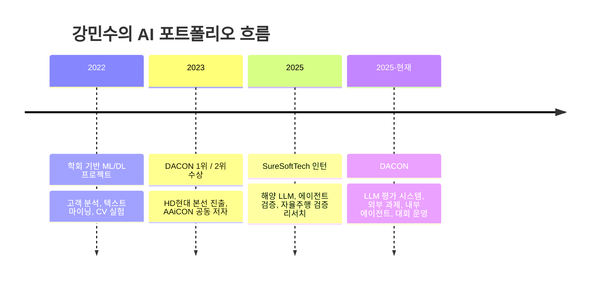

# 강민수 | Minsu Kang

> 데이터를 분석하고, AI를 설계하고, 검증하고, 결과를 서비스와 비즈니스 언어로 연결하는 사람

저는 특정 모델 하나만 파는 사람이 아니라, **문제 정의 → 데이터 분석 → 모델링 → 검증 → 문서화 → 협업**까지 이어지는 전체 흐름을 다루는 사람입니다.  
지원 포지션도 하나로 고정하지 않고, **데이터사이언티스트 / AI 개발자 / AI·ML 엔지니어 / AI 기획 / PM**까지 제가 기여할 수 있는 범위라면 모두 보고 있습니다.

<table>
  <tr>
    <td valign="top" width="52%">
      <strong>한눈에 보기</strong>  
      - 현재: DACON Data Science Team 
      - 이전: SureSoftTech AX응용기술팀 인턴 
      - 키워드: Data Science, AI Development, ML Engineering, AI Product 
      - 기술 축: LLM, NLP, Tabular, Time Series, OCR, Evaluation
    </td>
    <td valign="top" width="48%">
      <strong>검증된 결과</strong>  
      - DACON Challenger, 최고 34 / 155,582 
      - 1위 / 716팀 
      - 2위 / 1,166팀 
      - HD현대 예선 2위 / 330팀 
      - AAiCON 2023 공동 저자
    </td>
  </tr>
</table>

## 회사와 경력

| 기간 | 회사 | 역할 | 핵심 경험 |
| --- | --- | --- | --- |
| 2025.12 ~ 현재 | DACON | Competition Manager, Data Science Team | LLM 평가 시스템, 외부 AI 과제, 내부 에이전트, 대회 운영 |
| 2025.06 ~ 2025.11 | SureSoftTech | AI Developer Intern, AX응용기술팀 | 해양 특화 LLM, 에이전트 검증, 자율주행 검증 리서치 |

제가 회사 경험에서 중요하게 가져가는 건 특정 모델 자체보다, **실무에서 문제를 어떻게 구조화하고, 어떤 기준으로 검증하고, 어떤 문서와 협업 방식으로 결과를 연결했는가**입니다.

## 지원 가능한 직무 관점

| 직무 | 이 포트폴리오에서 보이는 강점 |
| --- | --- |
| 데이터사이언티스트 | EDA, feature engineering, validation, leaderboard 상위권 성과 |
| AI 개발자 | OCR + NER, LLM 평가, 도메인 LLM, 모델 실험 파이프라인 |
| AI·ML 엔지니어 | 학습/평가 흐름 설계, 데이터셋-모델-검증 연결, 재현 가능한 구조화 |
| AI 기획 / PM | 문제 정의, 지표 설계, 결과 문서화, 실무형 커뮤니케이션 |

## 제가 걸어온 흐름

## 대표 포트폴리오

### 1. 회사와 실무를 보여주는 작업

| 프로젝트 | 한 줄 설명 | 채용 관점 포인트 |
| --- | --- | --- |
| [DACON_LLM_Evaluation](https://github.com/Minsu5452/DACON_LLM_Evaluation) | DACON 플랫폼 LLM 평가 시스템 케이스 스터디 | 평가 지표, 검증 구조, 운영 관점 |
| [Marine_LLM](https://github.com/Minsu5452/Marine_LLM) | 해양 도메인 특화 LLM 케이스 스터디 | 도메인 적응, RAG, 실무형 AI 적용 |
| [KT_Agent_Verification](https://github.com/Minsu5452/KT_Agent_Verification) | AI 에이전트 검증 데이터셋 및 시나리오 설계 | agent quality, 평가 설계, 케이스 기반 검증 |

### 2. 실력을 외부에서 검증해준 작업

| 프로젝트 | 결과 | 채용 관점 포인트 |
| --- | --- | --- |
| [Genomic_Data_Breed_Classification](https://github.com/Minsu5452/Genomic_Data_Breed_Classification) | DACON 1위 / 716팀 | structured ML, ensemble, feature engineering |
| [Court_Judgment_Prediction](https://github.com/Minsu5452/Court_Judgment_Prediction) | DACON 2위 / 1,166팀 | long-text NLP, transformer fine-tuning |
| [HD_Hyundai_AI_Challenge](https://github.com/Minsu5452/HD_Hyundai_AI_Challenge) | 예선 2위 / 330팀, 본선 6위 / 11팀 | 산업형 예측 문제, 발표 경험, 팀 협업 |

### 3. 직접 만들고 끝까지 구현한 작업

| 프로젝트 | 한 줄 설명 | 채용 관점 포인트 |
| --- | --- | --- |
| [Receipt_Data_NER](https://github.com/Minsu5452/Receipt_Data_NER) | OCR부터 자동 라벨링, NER 학습까지 연결한 개인 프로젝트 | end-to-end 구현력 |
| [Salad_Demand_Forecasting](https://github.com/Minsu5452/Salad_Demand_Forecasting) | 센서/기상 데이터를 결합한 수요 예측 프로젝트 | 시계열 데이터 처리와 forecasting |
| [AAiCON2023](https://github.com/Minsu5452/AAiCON2023) | 수상 결과를 학술 기록으로 확장한 논문 저장소 | 결과를 문서와 연구로 연결하는 힘 |

## 수상과 지표

- DACON Challenger tier, 최고 34 / 155,582
- 유전체 품종 분류 AI 경진대회 1위 / 716팀
- 법원 판결 예측 AI 경진대회 2위 / 1,166팀
- HD현대 AI Challenge 예선 2위 / 330팀, 본선 6위 / 11팀
- AAiCON 2023 공동 저자

## 학력과 자격

- 국민대학교 AI빅데이터융합경영학과 학사
- SQLD, 2026.03.27
- 빅데이터분석기사 필기 합격
- TOEIC Speaking IM3
- BDA advanced track, LG Aimers 3기 수료

## 참고 자료

- [AAiCON 2023](https://github.com/Minsu5452/AAiCON2023)
- [유전체 공모전 수상인증서](./유전체 공모전 수상인증서_강민수.pdf)
- [법원 판결 공모전 수상 인증서](./법원 판결 공모전 수상 인증서_강민수.pdf)
- [LG Aimers 수료 자료](./LG AI.pdf)

## Contact

- GitHub: [Minsu5452](https://github.com/Minsu5452)
- Email: `daro980722@gmail.com`
- Email: `daro98@naver.com`
