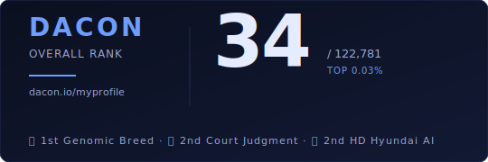

&nbsp;

&nbsp;

&nbsp;

  
  
  

&nbsp;

---

&nbsp;

## 소개

> 데이콘 DataScience 팀 ML 엔지니어.
> 122,781명 중 34위였던 경쟁자에서, 지금은 그 데이콘을 만드는 팀원으로.

이 자리까지는 긴 길이었다. '22–'23년 학부 시절 데이콘의 열한 개 대회에 참가해 여섯 개에서 팀장을 맡았고 — 유전체 품종 분류 **1위**, 법원 판결 예측·HD현대 AI Challenge **2위** — '23년을 전체 **34 / 122,781**위로 마쳤다. '24.08 국민대 AI빅데이터융합경영학과를 졸업한 뒤 슈어소프트테크에서 6개월간 AI 개발·검증을 맡았고, '25.12에 참가했던 그 **데이콘**에 데이터 사이언티스트로 합류했다. 관심은 길 전체에 있다 — 첫 EDA 셀에서 시작해 본 적 없는 데이터에서도 무너지지 않는 모델을 만드는 일, 그리고 이제는 그런 대회를 돌리는 인프라를 만드는 일까지.

ML engineer on DACON's DataScience team. Ranked 34 / 122,781 on DACON as a competitor — 1st in Genomic Breed Classification, 2nd in Court Judgment and HD Hyundai AI — now building the platform.

&nbsp;

## 경력

| 기간 | 회사 | 팀 | 직무 | 주요 업무 |
|:---:|:---:|:---:|:---:|:---|
| **2025.12 – 현재** | **DACON** | DataScience (DS팀) | 데이터 사이언티스트 | *팀원으로서의 기여 — 플랫폼 측 데이터 사이언스* |
| 2025.06 – 2025.11 | Suresofttech | AX응용기술팀 | AI 개발·검증 (인턴) | 해양 특화 LLM (오픈소스 기반 RAG + 파인튜닝) · 에이전트 검증 데이터셋 생성 · ML 검증 가이드라인 정리 |

&nbsp;

## 학력 및 활동

| 기간 | 소속 | 프로그램 | 비고 |
|:---:|:---:|:---:|:---:|
| 2018.03 – 2024.08 | 국민대학교 | AI빅데이터융합경영학과 (빅데이터경영통계 전공) | 졸업 |
| 2023.09 – 2024.03 | BDA | 빅데이터 연합 대외 동아리 (ML/DL) | 수료 |
| 2023.10 – 2023.11 | 국민대 경영대학 | 연결고리 14기 멘토링 | [repo](https://github.com/Minsu5452/Mentor_Mentee) |
| 2023.07 – 2023.09 | LG Aimers 3기 | LG AI 청년 교육 프로그램 | [certificate](LG%20AI.pdf) |
| 2023.03 – 2023.12 | D&A | 국민대 빅데이터 학회 (DL 트랙) | [repo](https://github.com/Minsu5452/D.A_DL) |
| 2022.03 – 2022.12 | D&A | 국민대 빅데이터 학회 (ML 트랙) | [repo](https://github.com/Minsu5452/D.A_ML) |

&nbsp;

## 대회 경력

| 수상 | 대회명 | 주최 | 역할 | 연도 | 링크 |
|:---:|:---|:---:|:---:|:---:|:---:|
| 🥇 **1위** | 유전체 정보 품종 분류 AI | DACON | 팀장 | 2023 | [repo](https://github.com/Minsu5452/Genomic_Data_Breed_Classification) · [인증서](%EC%9C%A0%EC%A0%84%EC%B2%B4%20%EA%B3%B5%EB%AA%A8%EC%A0%84%20%EC%88%98%EC%83%81%EC%9D%B8%EC%A6%9D%EC%84%9C_%EA%B0%95%EB%AF%BC%EC%88%98.pdf) |
| 🥈 **2위** | 법원 판결 예측 AI | DACON | 팀장 | 2023 | [repo](https://github.com/Minsu5452/Court_Judgment_Prediction) · [인증서](%EB%B2%95%EC%9B%90%20%ED%8C%90%EA%B2%B0%20%EA%B3%B5%EB%AA%A8%EC%A0%84%20%EC%88%98%EC%83%81%20%EC%9D%B8%EC%A6%9D%EC%84%9C_%EA%B0%95%EB%AF%BC%EC%88%98.pdf) |
| 🥈 **2위** | HD현대 AI Challenge | HD Hyundai × DACON | 팀원 | 2023 | [repo](https://github.com/Minsu5452/HD_Hyundai_AI_Challenge) |
| 12위 | 온라인 채널 제품 판매량 예측 | LG × DACON | 팀원 | 2023 | [repo](https://github.com/Minsu5452/Online_Product_Sales_Prediction) |
| 17위 | 감귤 착과량 예측 AI | DACON | 팀장 | 2022 | [repo](https://github.com/Minsu5452/Citrus_Yield_Prediction) |
| 107위 | 전력사용량 예측 AI | DACON | 팀장 | 2023 | [repo](https://github.com/Minsu5452/Power_Consumption_Forecasting) |
| 예선 | 지역 치안 안전 데이터 분석 | 경찰대학교 | 개인 | 2023 | [repo](https://github.com/Minsu5452/Traffic_Accident_Prediction) |
| 예선 | 지역사회 대기오염 예측 | AIFactory | 팀원 | 2023 | [repo](https://github.com/Minsu5452/Air_Pollution_Forecasting) |
| 예선 | 스마트농업 AI | 농림축산식품부 | 팀장 | 2023 | [repo](https://github.com/Minsu5452/Smart_Agriculture) |
| 예선 | 소외계층을 위한 AI 아이디어 | 한국원격대학협의회 | 팀장 | 2023 | [repo](https://github.com/Minsu5452/Supporting_Marginalized_Communities) |
| 예선 | L-point 고객 구매 예측 | L-point | 팀원 | 2022 | [repo](https://github.com/Minsu5452/L-point) |

&nbsp;

## 주요 프로젝트

<table>
<tr>
<td width="50%" valign="top">

### [유전체 품종 분류](https://github.com/Minsu5452/Genomic_Data_Breed_Classification)
🥇 1위 · DACON · 2023 · 팀장

SNP 유전체 프로파일 기반 다종 품종 분류. 정제된 피처 엔지니어링 위에 Gradient Boosted 앙상블.

</td>
<td width="50%" valign="top">

### [법원 판결 예측](https://github.com/Minsu5452/Court_Judgment_Prediction)
🥈 2위 · DACON · 2023 · 팀장

한국어 판결문 텍스트로부터 결과 예측. KoBERT / KLUE-RoBERTa 기반 Transformer 파인튜닝.

</td>
</tr>
<tr>
<td width="50%" valign="top">

### [HD현대 AI Challenge](https://github.com/Minsu5452/HD_Hyundai_AI_Challenge)
🥈 2위 · HD Hyundai × DACON · 2023 · 팀원

선박 항만 도착 시간 예측. 희소 이벤트 스트림 위에 강도 높은 피처 엔지니어링.

</td>
<td width="50%" valign="top">

### [영수증 NER](https://github.com/Minsu5452/Receipt_Data_NER)
개인 프로젝트 · 2023

OCR된 영수증에서 항목명·가격·업체를 토큰 단위로 추출. OCR 노이즈에서 정돈된 테이블까지 엔드투엔드.

</td>
</tr>
</table>

### 그 외 개인 작업
- **[시계열 예측](https://github.com/Minsu5452/Time_Series_Forecasting)** — 샐러드 수요 예측. 고전·딥러닝 시계열 혼합.
- **[텍스트 마이닝](https://github.com/Minsu5452/Text_Mining)** — 한국어 웹 크롤링 + 텍스트 분석.
- **[AAiCON2023 논문](https://github.com/Minsu5452/AAiCON2023)** — 실용 인공지능 학술대회 2차 논문 기재.

&nbsp;

## 기술 스택

  
  
  
  
  
  

  
  
  
  
  

주 관심 — 정형 ML · 시계열 예측 · 한국어 NLP · LLM 파인튜닝 · RAG · 에이전트 검증

&nbsp;

## GitHub 활동

&nbsp;

## 연락처

  
  

&nbsp;

<b>이전 학습 기록</b> (아카이브됨 — 기록용)

&nbsp;

| 연도 | 트랙 | 소속 |
|:---:|---|---|
| 2021 | [Python study](https://github.com/Minsu5452/Python_study) | 개인 스터디 |
| 2022 | [Machine Learning](https://github.com/Minsu5452/Machine_Learning) · [D&A ML](https://github.com/Minsu5452/D.A_ML) | 국민대 D&A |
| 2022 | [Deep Learning](https://github.com/Minsu5452/Deep_Learning) (Colorization SOTA 파인튜닝) | 국민대 |
| 2023 | [D&A DL](https://github.com/Minsu5452/D.A_DL) | 국민대 D&A |
| 2023 | [Mentor_Mentee](https://github.com/Minsu5452/Mentor_Mentee) (연결고리 14기) | 국민대 경영대학 |

&nbsp;

