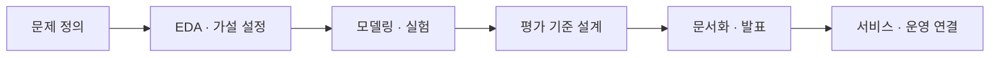
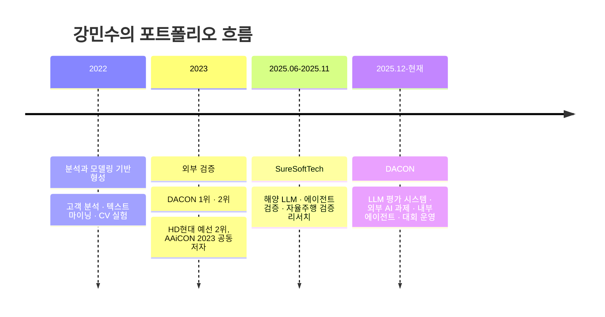

# 강민수 | Minsu Kang

### 회사 경험과 외부 검증 결과를 함께 가진 AI · Data 실무형 포트폴리오

데이터 분석, AI 개발, ML 엔지니어링, 평가 설계, 문서화, 운영 협업을 한 흐름으로 다룹니다.  
`Data Science` · `AI Development` · `ML Engineering` · `AI Planning` · `PM`

<table>
  <tr>
    <td valign="top" width="25%">
      <strong>실무 경험</strong>  
      DACON Data Science Team 
      SureSoftTech AX응용기술팀
    </td>
    <td valign="top" width="25%">
      <strong>외부 검증</strong>  
      DACON 1위 / 716팀 
      DACON 2위 / 1,166팀
    </td>
    <td valign="top" width="25%">
      <strong>직접 구현</strong>  
      OCR + NER 파이프라인 
      예측 · 분석 프로젝트 다수
    </td>
    <td valign="top" width="25%">
      <strong>확장 경험</strong>  
      평가 시스템 · 검증 시나리오 
      논문 · 보고서 · 발표
    </td>
  </tr>
</table>

> 한 가지 모델만 깊게 파는 사람보다, 문제를 정의하고 데이터를 읽고 모델을 설계한 뒤 성능을 검증하고 결과를 문서와 운영 언어로 연결하는 사람에 가깝습니다.

## 회사 경험

| 기간 | 조직 | 역할 | 담당 범위 |
| --- | --- | --- | --- |
| 2025.12 ~ 현재 | DACON | Competition Manager, Data Science Team | LLM 평가 시스템, 외부 AI 과제, 내부 에이전트, 대회 운영 |
| 2025.06 ~ 2025.11 | SureSoftTech | AI Developer Intern, AX응용기술팀 | 해양 특화 LLM, 에이전트 검증, 자율주행 검증 리서치 |

## 어떤 포지션에서 강점이 보이는가

| 포지션 | 이 포트폴리오에서 보이는 강점 | 바로 볼 레포 |
| --- | --- | --- |
| 데이터사이언티스트 | EDA, feature engineering, structured ML, 시계열 예측, 상위권 competition 성과 | [Genomic_Data_Breed_Classification](https://github.com/Minsu5452/Genomic_Data_Breed_Classification), [Court_Judgment_Prediction](https://github.com/Minsu5452/Court_Judgment_Prediction), [Power_Consumption_Forecasting](https://github.com/Minsu5452/Power_Consumption_Forecasting) |
| AI 개발자 | OCR + NER 파이프라인, 모델 적용, 실험 코드 구성, end-to-end 구현 | [Receipt_Data_NER](https://github.com/Minsu5452/Receipt_Data_NER), [Marine_LLM](https://github.com/Minsu5452/Marine_LLM) |
| AI · ML 엔지니어 | 평가 기준 설계, 검증 workflow, metric 조합, 재현 가능한 실험 구조 | [DACON_LLM_Evaluation](https://github.com/Minsu5452/DACON_LLM_Evaluation), [KT_Agent_Verification](https://github.com/Minsu5452/KT_Agent_Verification), [HD_Hyundai_AI_Challenge](https://github.com/Minsu5452/HD_Hyundai_AI_Challenge) |
| AI 기획 · PM | 평가 항목 정의, 운영 관점 문서화, 시나리오 설계, 발표와 협업 | [DACON_LLM_Evaluation](https://github.com/Minsu5452/DACON_LLM_Evaluation), [KT_Agent_Verification](https://github.com/Minsu5452/KT_Agent_Verification), [L-point_Customer_Analytics](https://github.com/Minsu5452/L-point_Customer_Analytics) |

## 제가 맡아온 일의 범위

## 어떻게 여기까지 왔는가

## 대표 작업

### 실무와 운영 관점을 보여주는 작업

<table>
  <tr>
    <td valign="top" width="33%">
      <strong><a href="https://github.com/Minsu5452/DACON_LLM_Evaluation">DACON_LLM_Evaluation</a></strong>  
      DACON 플랫폼에서 다양한 LLM을 같은 기준으로 비교하기 위한 평가 시스템 케이스 스터디  
      보이는 것: 평가 체계 · metric 설계 · 운영 감각
    </td>
    <td valign="top" width="33%">
      <strong><a href="https://github.com/Minsu5452/KT_Agent_Verification">KT_Agent_Verification</a></strong>  
      AI 에이전트를 시나리오와 데이터셋으로 검증한 케이스 스터디  
      보이는 것: 검증 설계 · failure case 정리 · 품질 관리
    </td>
    <td valign="top" width="34%">
      <strong><a href="https://github.com/Minsu5452/Marine_LLM">Marine_LLM</a></strong>  
      산업 도메인에 LLM을 적용하기 위한 적응과 평가 경험 정리  
      보이는 것: 도메인 AI · retrieval 관점 · 품질 점검
    </td>
  </tr>
</table>

### 실력을 외부에서 검증해준 작업

<table>
  <tr>
    <td valign="top" width="33%">
      <strong><a href="https://github.com/Minsu5452/Genomic_Data_Breed_Classification">Genomic_Data_Breed_Classification</a></strong>  
      고차원 구조화 데이터 문제에서 1위를 만든 앙상블 솔루션  
      보이는 것: structured ML · feature engineering · ensemble
    </td>
    <td valign="top" width="33%">
      <strong><a href="https://github.com/Minsu5452/Court_Judgment_Prediction">Court_Judgment_Prediction</a></strong>  
      장문 판결문을 다룬 NLP 대회 2위 솔루션  
      보이는 것: long-text NLP · transformer · 팀 리드
    </td>
    <td valign="top" width="34%">
      <strong><a href="https://github.com/Minsu5452/HD_Hyundai_AI_Challenge">HD_Hyundai_AI_Challenge</a></strong>  
      산업형 예측 문제에서 예선 2위, 본선 발표까지 수행한 프로젝트  
      보이는 것: 시계열 · 회귀 · 발표 · 협업
    </td>
  </tr>
</table>

### 직접 만들고 분석까지 연결한 작업

<table>
  <tr>
    <td valign="top" width="33%">
      <strong><a href="https://github.com/Minsu5452/Receipt_Data_NER">Receipt_Data_NER</a></strong>  
      OCR부터 자동 라벨링, NER 학습까지 혼자 연결한 개인 프로젝트  
      보이는 것: end-to-end 구현력 · 데이터셋 구축
    </td>
    <td valign="top" width="33%">
      <strong><a href="https://github.com/Minsu5452/Power_Consumption_Forecasting">Power_Consumption_Forecasting</a></strong>  
      건물별 전력 사용량을 예측한 상위 8.7% 시계열 솔루션  
      보이는 것: forecasting · baseline 비교 · 팀 리드
    </td>
    <td valign="top" width="34%">
      <strong><a href="https://github.com/Minsu5452/L-point_Customer_Analytics">L-point_Customer_Analytics</a></strong>  
      고객 행동 데이터를 분석해 세그먼트와 마케팅 전략으로 연결한 프로젝트  
      보이는 것: 고객 분석 · 비즈니스 해석 · 전략 제안
    </td>
  </tr>
</table>

## 수상과 기록

| 구분 | 내용 |
| --- | --- |
| 대표 수상 | 유전체 품종 분류 1위 / 716팀 |
| 대표 수상 | 법원 판결 예측 2위 / 1,166팀 |
| 대표 수상 | HD현대 AI Challenge 예선 2위 / 330팀 |
| 학술 기록 | [AAiCON 2023](https://github.com/Minsu5452/AAiCON2023) 공동 저자 |

## 학력과 자격

| 구분 | 내용 |
| --- | --- |
| 학력 | 국민대학교 AI빅데이터융합경영학과 학사 |
| 자격 | SQLD |
| 자격 | 빅데이터분석기사 필기 합격 |
| 어학 | TOEIC Speaking IM3 |
| 수료 | BDA advanced track, LG Aimers 3기 |

증빙 자료 보기

- [유전체 공모전 수상 인증서](./유전체 공모전 수상인증서_강민수.pdf)
- [법원 판결 공모전 수상 인증서](./법원 판결 공모전 수상 인증서_강민수.pdf)
- [LG Aimers 수료 자료](./LG AI.pdf)

## Contact

- GitHub: [Minsu5452](https://github.com/Minsu5452)
- Email: `daro980722@gmail.com`
- Email: `daro98@naver.com`
